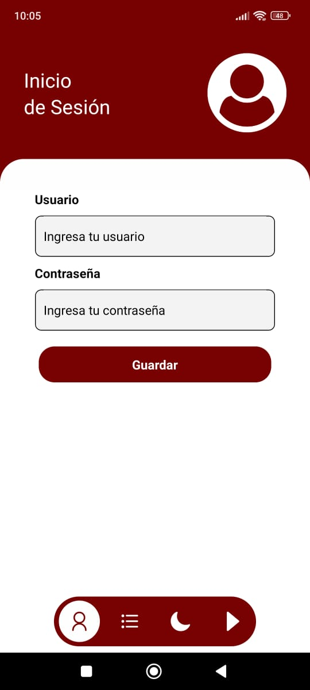
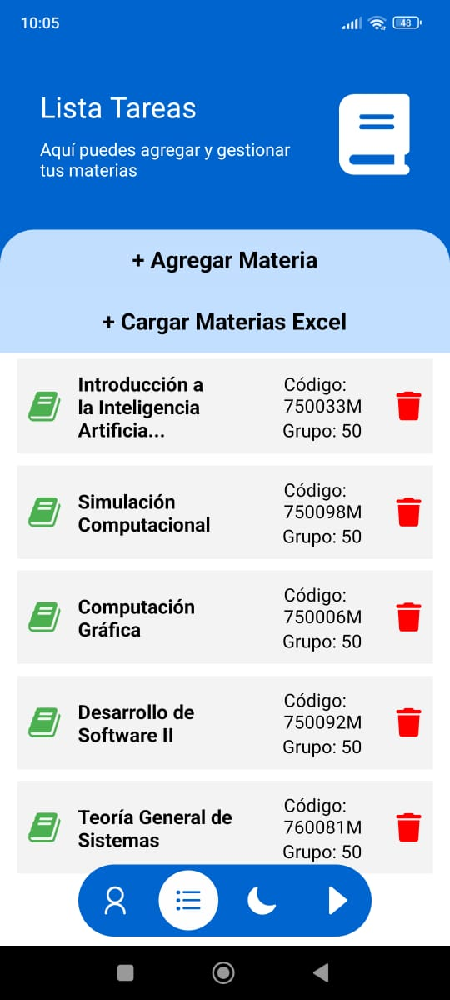
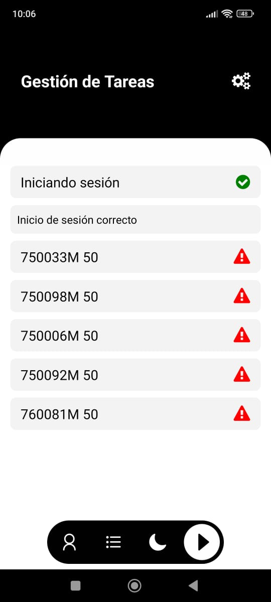

<div align="center">
  
  <h1>UnivalleMatriculaApp 📚</h1>
</div>

**Aplicación de matriculación** diseñada para gestionar materias y **matricularlas rápidamente en el SIRA**.

---

## Características 🌟

- **Inicio de Sesión:** Accede fácilmente a tu cuenta de estudiante.
- **Gestión de Materias:** Agrega, organiza y elimina materias según tus necesidades.
- **Matriculación Rápida:** Envía tus materias directamente al SIRA con un solo clic.
- **Cambio de Tema:** Alterna entre tema claro y oscuro para una experiencia personalizada.

---

## Requisitos 📋

- **Node.js** v16 o superior.
- **React Native CLI** instalado globalmente.
- **Android Studio** (para compilar el APK).

---

## Instalación y Ejecución 🚀

### 1. Clona el repositorio:
```bash
git clone https://github.com/Ceball0s/UnivalleMatriculaApp.git
cd UnivalleMatriculaApp
```

### 2. Instala las dependencias
```bash
npm install
```
### 3. Ejecuta la app en modo desarrollo:
```bash
npx expo start
```
### 4. Genera el APK ( debes iniciar session en expo ):
```bash
eas build --platform android --profile preview
```

## Área de Screenshots 📸
<div align="center"> <h2>Vista Previa de la App</h2>    </div>


